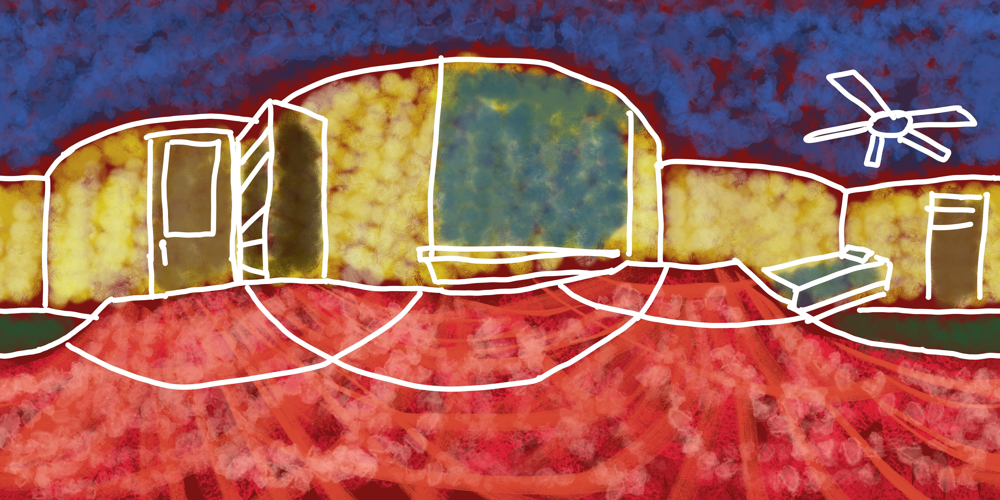
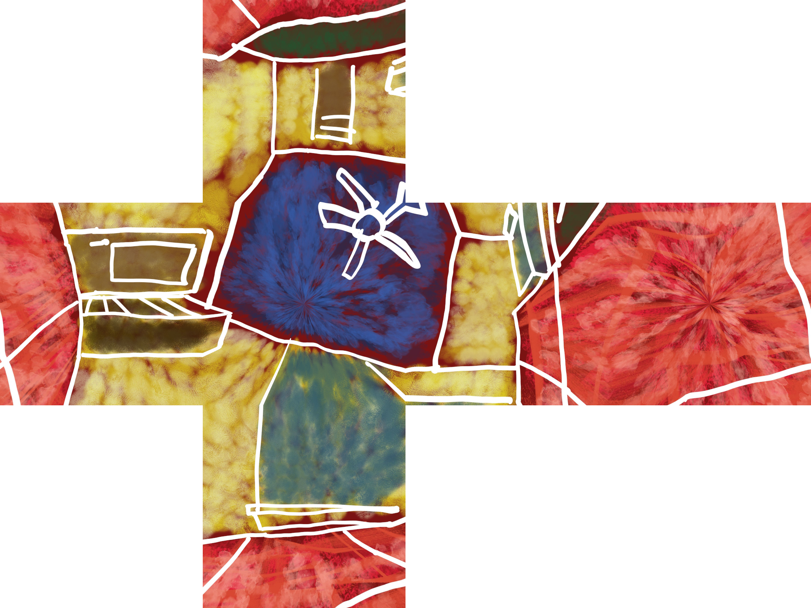
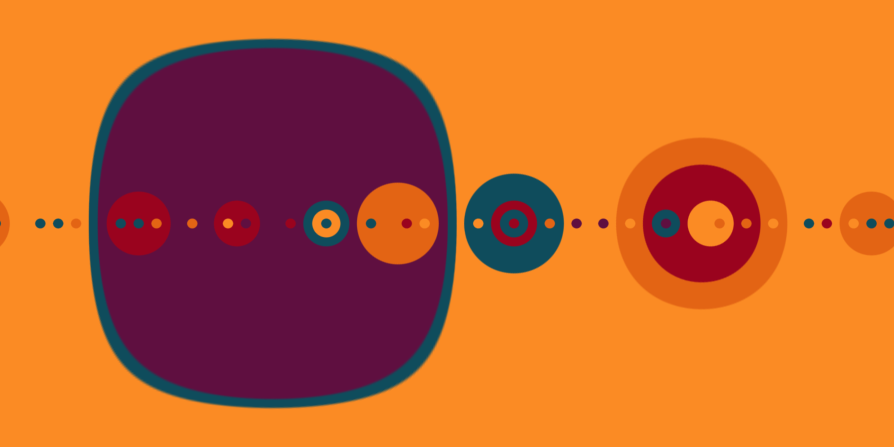
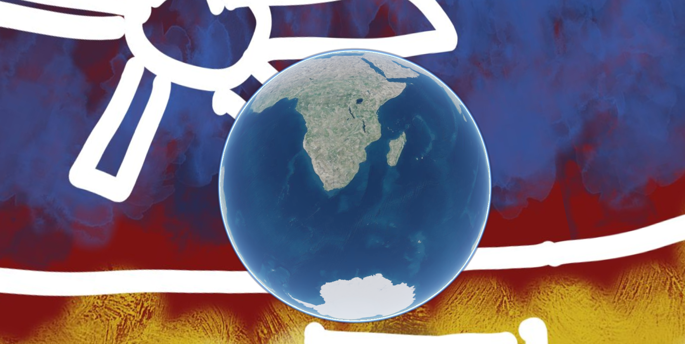

# Panoramas (2021)

Utility Scripts for working with 360° panorama images. Some scripts are
designed specifically for interoperability with
[CesiumJS](https://github.com/CesiumGS/cesium).

:warning: ARCHIVED - Due to a Assignment of Inventions Agreement I signed when I started working at Cesium, this copyright for this project was assigned to my employer Cesium GS, Inc. This project is still open-source under the Apache 2.0 license. However, I choose not to maintain this repo anymore, and have archived it.

I made these scripts for my own artistic uses. These scripts are written simply
with little error checking. This is not intended for production use.

## Installation

The only dependencies are Numpy and OpenCV. These can be installed via
`pip`

```
pip install -r requirements.txt
```

## Usage

```
python main.py [OPTIONS] INPUT_FORMAT OUTPUT_FORMAT IMAGE [IMAGE, ...]
```

Right now, only some combinations are supported:

| Input format | Output format | Input Image(s) | Output image(s) | Description |
|--------------|--------------|------------|----|---|
| sphere | cubemap | equirectangular | 6 faces: +x, -x, +y, -y, +z, -z | Project a equirectangular panorama (2:1 aspect ratio) to 6 faces of a cubemap
| stereographic | sphere | north_hemisphere, south_hemisphere | equirectangular |unproject two stereographic projections to a single equirectangular panorama |

For full options, see the `-h/--help` option.

### Example: Convert spherical panorama to cubemap

```
python main.py sphere cubemap input_image.png
```

This example converts a 360° panorama from a 2:1 aspect ratio equirectangular
image (`(longitude, latitude)` map) to a cubemap for use as a skybox or
environment map.

Input example:



Output example:



Note: the output is 6 images. They are labeled according to a z-up coordinate system compatible with the skybox in CesiumJS (See [SkyBox documentation](https://cesium.com/docs/cesiumjs-ref-doc/SkyBox.html?classFilter=skybox))

### Example: Convert a pair of stereographic projections to a panorama

```
python main.py stereographic sphere northern_hemisphere.png southern_hemisphere.png
```

In this particular example, my north and south hemispheres are the same image.

| Northern Hemisphere | Southern Hemisphere |
|------------------|------------------|
|  |  |

Output panorama:



### Visualizing output

This repo provides a method for viewing cubemap output. The output images must
be named `output/skybox${faceName}.png` (which is the default). These can be
viewed with the provided viewer in `index.html`. To do so, serve this repo as a
static site, e.g. with `http-server` (a NodeJS package) or
`python -m http.server` (Python3 built-in module) since browsers may block the
images otherwise due to security policies.

